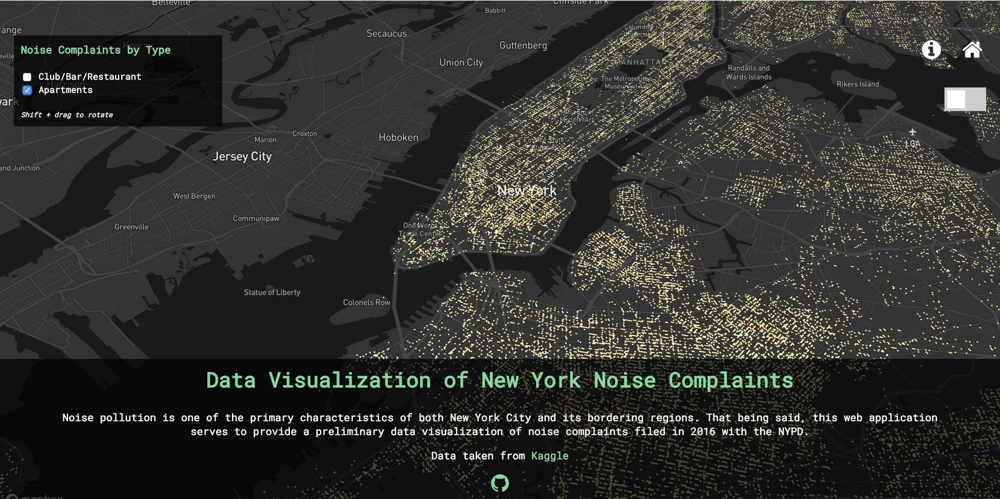

# Summer Internship Project - Simon

Utilizes citywide police data to show the number of noise complaints in various regions within the greater New York area.

## Description

In the "city that never sleeps", this web application visualizes the areas within New York City and its surrounding areas that were the noisiest during the year 2016.

Uses Mapbox, Deck.GL, and React

## Requisites For Running This Application
1. Ensure Node is installed (running `node -v` on command line should return version >=6.0)
2. Install Yarn if not installed already (running `yarn version` on command line should return version >=0.23.4)

## Running the Application
1. Run `git clone [This Repository]` and cd into the folder
3. In a new terminal window, run `yarn install`.
4. Once yarn install is complete, run `yarn start`
5. A localhost window should open up automatically

## Testing
1. Ensure you are at the root
2. Run `yarn selenium`
3. This will execute a series of Chrome Selenium tests

## Contact
Reach out to me at simonjzhou@gmail.com if you have any questions
